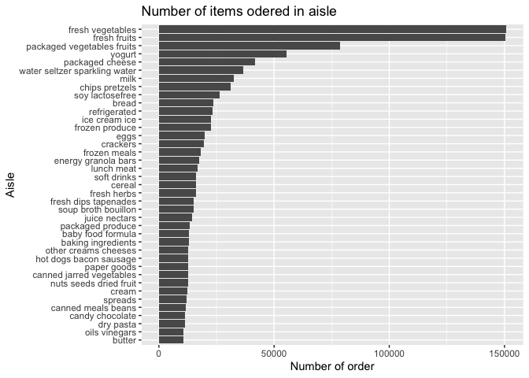

p8105\_hw3\_jf3355
================
Jiahao Fan
10/19/2021

``` r
library(p8105.datasets)
library(tidyverse)
```

    ## ── Attaching packages ─────────────────────────────────────── tidyverse 1.3.1 ──

    ## ✓ ggplot2 3.3.5     ✓ purrr   0.3.4
    ## ✓ tibble  3.1.5     ✓ dplyr   1.0.7
    ## ✓ tidyr   1.1.4     ✓ stringr 1.4.0
    ## ✓ readr   2.0.2     ✓ forcats 0.5.1

    ## ── Conflicts ────────────────────────────────────────── tidyverse_conflicts() ──
    ## x dplyr::filter() masks stats::filter()
    ## x dplyr::lag()    masks stats::lag()

``` r
library(lubridate)
```

    ## 
    ## Attaching package: 'lubridate'

    ## The following objects are masked from 'package:base':
    ## 
    ##     date, intersect, setdiff, union

``` r
data("instacart")
```

``` r
#description of data
#There are 15 variables in this dataset:

#order_id: order identifier
#product_id: product identifier
#add_to_cart_order: order in which each product was added to cart
#reordered: 1 if this prodcut has been ordered by this user in the past, 0 otherwise
#user_id: customer identifier
#eval_set: which evaluation set this order belongs in (Note that the data for use in this class is exclusively from the “train” eval_set)
#order_number: the order sequence number for this user (1=first, n=nth)
#order_dow: the day of the week on which the order was placed
#order_hour_of_day: the hour of the day on which the order was placed
#days_since_prior_order: days since the last order, capped at 30, NA if order_number=1
#product_name: name of the product
#aisle_id: aisle identifier
#department_id: department identifier
#aisle: the name of the aisle
#department: the name of the department
```

The dataset has 1384617 observations and 15 columns. There are some key
variable such as product\_name: name of the product,aisle: the name of
the aisle.

How many aisles are there, and which aisles are the most items ordered
from?

``` r
num_aisle = 
  instacart %>%
  select(aisle)%>%
  n_distinct()
```

There is 134 aisles.

``` r
instacart %>%
  count(aisle) %>%
  arrange(desc(n),1)
```

    ## # A tibble: 134 × 2
    ##    aisle                              n
    ##    <chr>                          <int>
    ##  1 fresh vegetables              150609
    ##  2 fresh fruits                  150473
    ##  3 packaged vegetables fruits     78493
    ##  4 yogurt                         55240
    ##  5 packaged cheese                41699
    ##  6 water seltzer sparkling water  36617
    ##  7 milk                           32644
    ##  8 chips pretzels                 31269
    ##  9 soy lactosefree                26240
    ## 10 bread                          23635
    ## # … with 124 more rows

From the table, we can see the most items ordered is fresh vegetables.

\#make the plot

``` r
instacart %>%
  count(aisle) %>%
  rename(count=n)%>%
  filter(count > 10000)%>%
  mutate(
    aisle = factor(aisle),
    aisle = forcats::fct_reorder(aisle, count)
  )%>%
  ggplot(aes(x= count, y= aisle))+ geom_bar(stat = "identity")+ labs(
    title = "Number of items odered in aisle",
    x = "Number of order",
    y = "Aisle"
  )
```

<!-- -->

\#make the table

``` r
most_popular_item_df = 
  instacart %>%
  filter(aisle == "baking ingredients"|
         aisle == "dog food care"|
         aisle == "packaged vegetables fruits")%>%
  group_by(aisle)%>%
  count(product_name)%>%
  rename(ordered_times = n)%>%
  mutate(rank = min_rank(desc(ordered_times)))%>%
  filter(rank < 4)%>%
  arrange(aisle, rank)
knitr::kable(most_popular_item_df)
```

| aisle                      | product\_name                                 | ordered\_times | rank |
|:---------------------------|:----------------------------------------------|---------------:|-----:|
| baking ingredients         | Light Brown Sugar                             |            499 |    1 |
| baking ingredients         | Pure Baking Soda                              |            387 |    2 |
| baking ingredients         | Cane Sugar                                    |            336 |    3 |
| dog food care              | Snack Sticks Chicken & Rice Recipe Dog Treats |             30 |    1 |
| dog food care              | Organix Chicken & Brown Rice Recipe           |             28 |    2 |
| dog food care              | Small Dog Biscuits                            |             26 |    3 |
| packaged vegetables fruits | Organic Baby Spinach                          |           9784 |    1 |
| packaged vegetables fruits | Organic Raspberries                           |           5546 |    2 |
| packaged vegetables fruits | Organic Blueberries                           |           4966 |    3 |

\#make another table

``` r
mean_hour_df = 
  instacart %>%
  filter(
         product_name == "Pink Lady Apples"|
         product_name == "Coffee Ice Cream") %>%
  group_by(product_name,order_dow)%>%
  summarize(mean_hour = mean(order_hour_of_day))%>%
  pivot_wider(names_from = "order_dow", values_from = "mean_hour")%>%
  rename("Sunday" = "0", 
         "Monday" = "1", 
         "Tuesday" = "2", 
         "Wednesday" = "3",
         "Thursday" = "4",
         "Friday" = "5",
         "Saturday" = "6")
```

    ## `summarise()` has grouped output by 'product_name'. You can override using the `.groups` argument.

``` r
knitr::kable(mean_hour_df)
```

| product\_name    |   Sunday |   Monday |  Tuesday | Wednesday | Thursday |   Friday | Saturday |
|:-----------------|---------:|---------:|---------:|----------:|---------:|---------:|---------:|
| Coffee Ice Cream | 13.77419 | 14.31579 | 15.38095 |  15.31818 | 15.21739 | 12.26316 | 13.83333 |
| Pink Lady Apples | 13.44118 | 11.36000 | 11.70213 |  14.25000 | 11.55172 | 12.78431 | 11.93750 |

\#Problem 2

``` r
data("brfss_smart2010")
```

\#clean the dataset

``` r
brfss_smart = 
  brfss_smart2010 %>%
  janitor::clean_names()%>%
  filter(topic == "Overall Health")%>%
  mutate(response = factor(response, 
                           levels = c("Poor","Fair","Good","Very Good","Excellent")))%>%
  rename(state = locationabbr, county = locationdesc)%>%
  arrange(response)
```

\#In 2002, which states were observed at 7 or more locations? What about
in 2010?

``` r
df_2002 = 
  brfss_smart%>%
  filter(year == "2002")%>%
  group_by(state)%>%
  select(year,state,county)%>%
  distinct()%>%
  summarize(num_locations = n())%>%
  filter(num_locations >=7)
df_2010 = 
  brfss_smart%>%
  filter(year == "2010")%>%
  group_by(state)%>%
  select(year,state,county)%>%
  distinct()%>%
  summarize(num_locations = n())%>%
  filter(num_locations >=7)
```

In 2002,CT,FL,MA,NC,NJ,PA states were observed at 7 or more locations.
In 2010,CA,CO,FL,MA,MD,NC,NE,NJ,NY,OH states were observed at 7 or more
locations.

\#Make the plot of this average value over time within a state

``` r
new_brfss_df= 
  brfss_smart %>%
  filter(response == "Excellent") %>%
  group_by(year,state) %>%
  mutate(mean_value= mean(data_value)) %>%
  group_by(year,state,mean_value) %>%
  summarize() %>%
  ggplot(aes(x= year,y=mean_value,color=state))+geom_line()+labs(
    title = "Average value over time with a state",
    x= "Year",
    y = "Mean of data value"
  )
```

    ## `summarise()` has grouped output by 'year', 'state'. You can override using the `.groups` argument.

# make a two-panel plot

``` r
two_panel_df = 
  brfss_smart %>%
  filter(year%in%c("2006","2010"),state == "NY") %>%
  group_by(year,response,data_value) %>%
  summarize() %>%
  ggplot(aes(x=data_value,fill=response))+geom_density(alpha= .5)+
           facet_grid(.~year)+
           labs(title= "Response among locations in NY",
         x = "data value",
         y= "Response")
```

    ## `summarise()` has grouped output by 'year', 'response'. You can override using the `.groups` argument.
